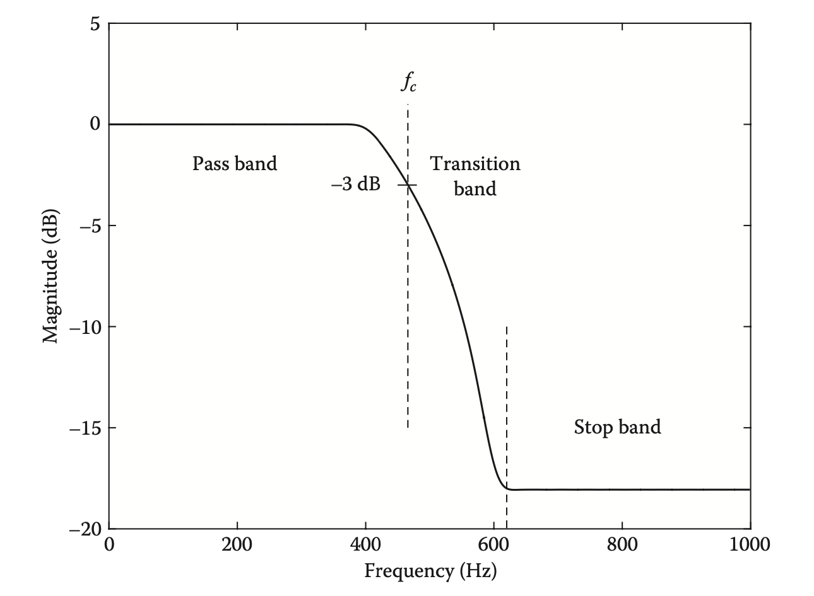

# Rappresentazione di un filtro

## Equazione Matematica

Un filtro digitale può essere espresso mediante un’equazione che metta in relazione il segnale d’entrata con quello d’uscita. Il segnale d’uscita può essere descritto come risultato del lavoro di somme, sottrazioni e moltiplicazioni del campione corrente o di quelli precedentemete transitati.‌

In letteratura, il segnale in entrata ad un filtro si chiama $$x$$ mentre la sua uscita si chiama $$y$$ . I campioni in entrata, processati ed in uscita dal filtro vengono convenzionalmente numerati, indicizzati ed indicati: $$x[0]$$ è il campione zero del segnale entrante, $$x[1]$$ il suo successivo $$n+1$$mentre $$y[1]$$ è lo stesso campione ma in uscita dal filtro.

## Diagramma a blocchi

## Risposta in frequenza

La Figura mostra la risposta in frequenza di un filtro passa-basso. La frequenza è divisa in tre bande, etichettate sull'asse orizzontale. La banda passante è la regione \(banda di frequenza\) in cui il filtro deve passare il suo ingresso attraverso la sua uscita con guadagno unitario. Per un filtro passa-basso \(come mostrato\), la banda passante raggiunge da una frequenza di zero fino a un certo limite di frequenza. Per un filtro passa-alto, la banda passante appare sul lato destro del grafico e si estende dal limite di frequenza fino alla massima frequenza possibile. La banda passante di qualsiasi filtro realizzabile sarà solo approssimativamente piatta; la deviazione dalla planarità è chiamata ondulazione ed è spesso specificata dando il rapporto tra il più alto e guadagno più basso nella banda passante, espresso in decibel. Il filtro passa-basso o passa-alto ideale avrebbe un'increspatura di 0 dB. La banda di arresto di un filtro passa-basso o passa-alto è la banda di frequenza su cui si intende che il filtro non trasmetta il suo ingresso. L'attenuazione della banda di arresto è la differenza, in decibel, tra il guadagno più basso nella banda passante e il guadagno più alto nella banda di arresto. Idealmente questo sarebbe infinito; più alto è il migliore. Infine, un filtro realizzabile, la cui risposta in frequenza è sempre una funzione continua della frequenza, deve avere una banda di frequenza sulla quale il guadagno scende dal guadagno della banda passante al guadagno della banda di arresto; questa è chiamata banda di transizione. Più è sottile questa banda, più è ideale il filtro.

## Impulse Response

Si può osservare l’effetto di un filtro sia nel dominio del tempo che in quello della frequenza. Un’immagine prima ed una dopo l’applicazione, possono mostrare l’effetto del filtro. Senza dubbio alcune tipologie di segnali d’entrata possono mostrare l’effetto del filtro più chiaramente di altre. Per testare un filtro abbiamo bisogno di un segnale di entrata contenente tutte le frequenze necessarie.

Il rumore bianco, che contiene tutte le frequenze ci indica come un filtro risponde nel dominio della frequenza. Ma una visione completa dell’azione del filtro deve contemplare un’analisi anche nel dominio del tempo, nella sua risposta ad i transienti temporali.

Esiste una relazione inversa tra durata e contenuto spettrale di un segnale. Un’oscillazione sinusoidale di infinita durata contiene una sola frequenza, un impulso ha uno spettro allargato.

Nei sistemi digitali il segnale più breve possibile è di un solo campione. Questo segnale continee energia su tutto lo spettro di frequenze ad una data frequenza di campionamento.

Una via generalizzata di caratterizzare un filtro è appunto quella di descriverne il comportamento temporale in risposta ad un impulso unitario, di un solo campione. La sua uscita, la risposta all’impulso, descrive il comportamento in ampiezza nel tempo in uscita dal filtro, in perfetta coerennza con quanto descrivibile nel dominio della frequenza. Lo stesso segnale di uscita descritto in domini diversi.

In linea generale un IR lungo corrisponde ad una banda molto stretta in frequenza, mentre un impulso corto ad una risposta larga in frequenza.

Un’ulteriore caratteristica dei filtri è l’eventuale effetto sulla fase di un segnale sinusoidale in entrata. La risposta in fase di un filtro può essere descritta in termini di rotazione di fase espressa in radianti oppure in termini di ritardo di fase, che ne indica lo slittamento temporale in secondi

## Trasformata Zeta

Un'equazione di un filtro digitale non necessariamente rivela le sue caratteristiche audio. In letteratura un filtro è rappresentato attraverso la _trasformata zeta,_ che mappa gli effetti dei ritardi del campione in un'immagine bidimensionale del dominio della frequenza denominato _piano complesso zeta_. Su questo piano vengono rappresenntati _poli_ per i picchi di risonanza e _zeri_ per i punti di ampiezza nulla dell'uscita del filtro. Un _filtro a due poli_, per esempio, indica due picchi di risonanza.

esempio due poli

La _trasformata zeta_ è un concetto importante per lo sviluppo di un filtro in quanto rappresentazione matematica di passaggio tra le caratteristiche del filtro ed i suoi parametri di implementazione. Rimane però un'applicazione astratta con relazioni solo indirette con i parametri fisici del filtro.

Nella rappresentazione software di un filtro si opera in processi applicati ai campioni audio, in termini di operazioni matematiche e ritardi a questi applicati. Generalmente quindi si descrive un filtro con diagrammi di flusso che ne dichiarino il percorso, rispopste all'impulso e risposte in frequenza.

