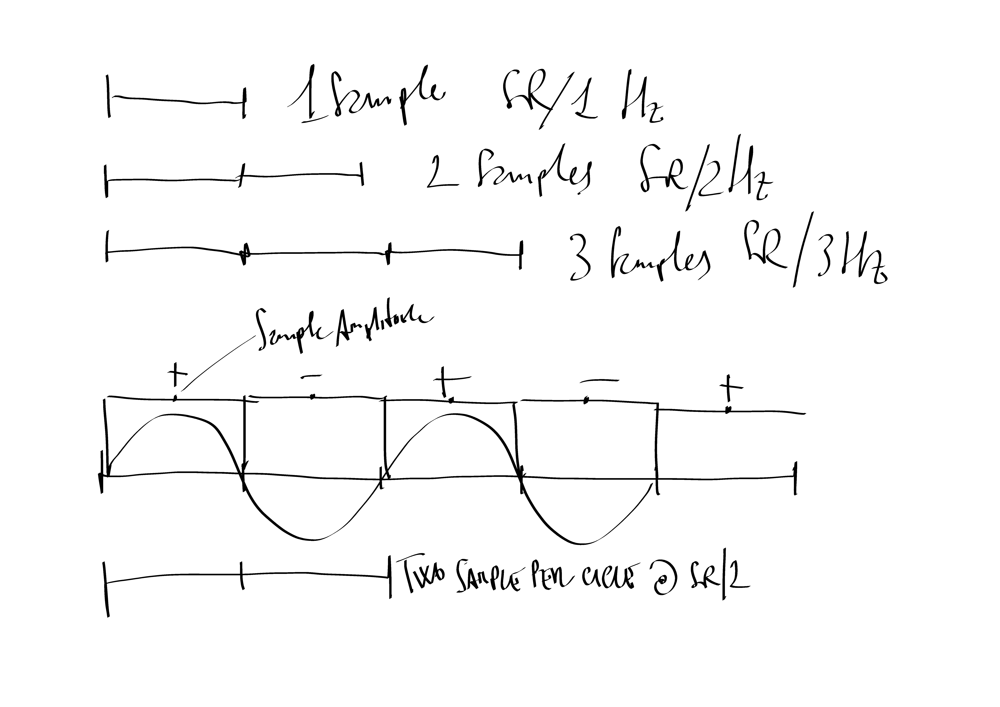
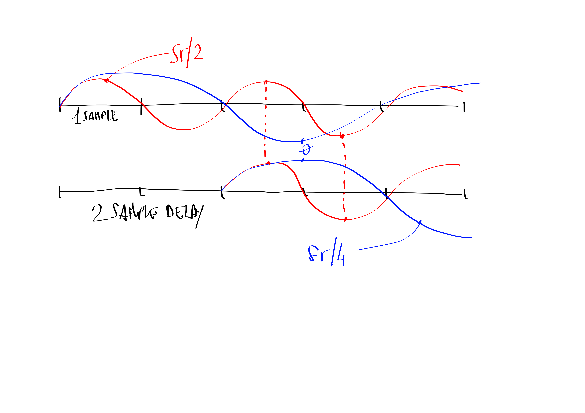

# Sample Rate

Prima di inoltrarsi per le vie tradizionali, delle equazioni e dei diagrammi a blocchi, nei meandri del regno dei filtri digitali, è necessario riflettere sul tema _frequenza di campionamento_ e sulle sue principali implicazioni in termini operativi e musicali. La più evidente e necessaria delle riflessioni da cui partire è: il campione, come unità minima, è il periodo di una frequenza esterna alla banda audio rappresentabile a quella frequenza di campionamento.

Tabella riassuntiva delle durate in _microsecondi_ del _periodo_ di un campione $$T = 1/sr$$

| frequenza di campionamento | durata di un campione in microsecondi |
| ---: | :--- |
| 32000 | 0,03125000000000000 |
| 48000 | 0,02083333333333330 |
| 96000 | 0,01041666666666670 |
| 192000 | 0,00520833333333333 |
| 384000 | 0,00260416666666667 |

Il rapporto tra il _periodo_ del campione e la banda passante espressa dal teorema del campionamento $$sr > 2f_{max}$$ mette in chiaro che il campione ha relazione in banda passante proprio a $$f_{max}$$ ovvero il punto in cui il campione dura la metà del periodo di $$f_{max}$$il cui periodo è quindi inscritto in due campioni.

Un campione di ritardo ha quindi un peso temporale enorme nel dominio di queste grandezze in quanto semiperiodo della massima frequenza rappresentabile. In un moto oscillatorio descritto dall'aternanza di _semi-periodi_ positivi e negativi, un _semi-periodo \(_e quindi un campione\) di ritardo crea una cancellazione di fase che annulla l'oscillazione. Come vedremo questo comportamento descrive un primo modello di filtro da cui inizieremo l'esplorazione.

Sulla base dello stesso ragionamento, possiamo quindi affermare che la somma tra un segnale complesso e _se stesso ritardato di un campione_ pone la condizione per una cancellazione a _nyquist._ Ma chi è il nostro _nyquist?_ A _384000Hz_ di frequenza di campionamento avrò una cancellazione a _192000Hz_ in quanto limite estremo della banda audio, in quello che potrebbe essere descritto come un filtro passa basso. Potrò dire di sentire il filtro?

Nel manuale del _Publison Infernal Machine 90,_ una delle macchine utilizzate da Luigi Nono nella messa in scena elettroacustica dei propri brani con _Live Electronics_ c'è un riferimento al tempo minimo di delay ottenibile con quella macchina, _40 microsecondi_, utilizzabile per realizzare effetti di phasing, secondo le istruzioni, sommando il suono ritardato con quello originale. Quel tempo minimo era facilmente ottenibile per quella macchina che aveva frequenza di campionamento di _50KHz_ e quindi ottenibile semplicemente con due campioni di ritardo $$0,00004 \times 50000 = 2$$ 

Di seguito una tabella di ragionamento, contenente il numero di campioni necessari per ottenere 40 microsecondi a diverse e comuni frequenze di campionamento. 

| sample rate | campionin in 40 microsecondi |
| ---: | :--- |
| 32000 | 1,28 |
| 48000 | 1,92 |
| 96000 | 3,84 |
| 192000 | 7,68 |
| 384000 | 15,36 |

Indicando l'effetto phasing tra due suoni ritardati di due campioni tra loro, a prescindere dalla frequenza di campionamento, sulla base del ragionamento sopra esposto potremo facilmente intuire che il punto di cancellazione tra i due spettri avverrà a $$sr/4$$ quindi nel caso di Nono ad una frequenza di 12500Hz.

Quando viene introdotto un ritardo, seppur breve, è utile considerare le unità di tempo relative alla lunghezza di un ciclo/campione per una data frequenza di campionamento. Questo può essere espresso come una relazione tra frequenza e ciclo, nonché in unità di gradi o radianti per uno sfasamento. 

